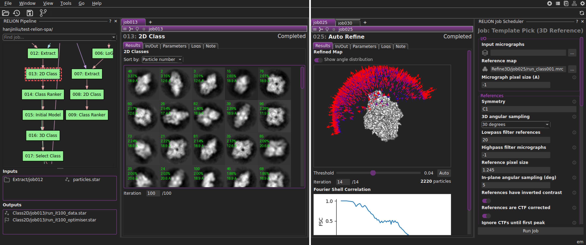
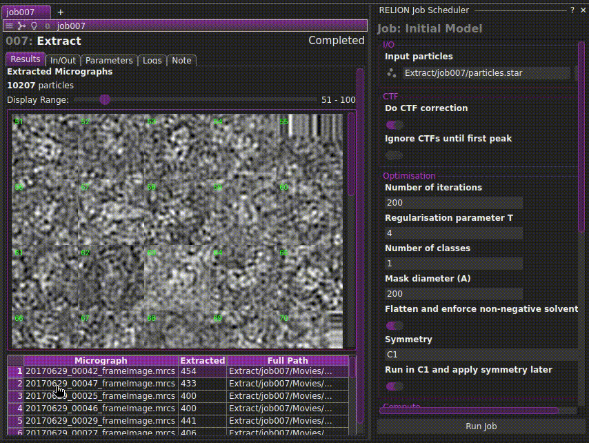

# himena-relion

[](https://pypi.org/project/himena-relion)
[](https://pypi.org/project/himena-relion)
[](https://codecov.io/gh/hanjinliu/himena-relion)

-----

`himena-relion` is a modern RELION GUI implemented as a [himena](https://github.com/hanjinliu/himena) plugin.

(Original dataset is from [RELION STA tutorial](https://relion.readthedocs.io/en/latest/SPA_tutorial/Introduction.html) and [subtomogram tutorial](https://relion.readthedocs.io/en/latest/STA_tutorial/Introduction.html))



:warning: `himena-relion` is actively under development. Please be cautious when using it for your real data processing.

#### [&rarr; Documentation](https://hanjinliu.github.io/himena-relion/)

## Highlights

#### View, queue and run RELION single-particle and tomography jobs



Outputs of most of the job types can be directly visualized in the GUI. New jobs can be created from command palette (Ctrl+Shift+P) or the action hint button on the job window title bar, which automatically fills in the input parameters. Output files can drag-and-dropped to the input fields of new jobs.

#### Efficient 2D/3D rendering over SSH using [vispy](https://github.com/vispy/vispy) and EGL


`himena-relion` is not a web-based application - this has a huge advantage in the interactive rendering of large images that is essential especially for cryo-ET. Owing to the powerful [`vispy`](https://github.com/vispy/vispy) backend and EGL offscreen rendering, `himena-relion` can provide efficient 2D/3D rendering even over SSH.

#### View and open jobs from the flowchart


You can interactively view your RELION job pipeline as a flowchart, open jobs and its input/output files. Owing to the extensibility of [`himena`]((https://github.com/hanjinliu/himena)), wide range of file formats are supported and are even customizable.

#### Make the most use of the RELION "external" jobs

RELION supports "external" jobs that can run arbitrary commands or scripts as a RELION job and integrate them into the RELION pipeline, but developers have to carefully check the outputs, and the users do not have a convenient way to run and manage them.

By subclassing `RelionExternalJob`, you can safely create external jobs with user-friendly job runner, input/output connection and the widget specific to your job. For example, `himena-relion` has built-in external jobs for [Find Beads 3D and Erase Gold](https://github.com/hanjinliu/himena-relion/blob/main/src/himena_relion/relion5_tomo/extensions/erase_gold/jobs.py) using the [IMOD](https://bio3d.colorado.edu/imod/) package.

## Installation

`himena-relion` is a plugin of [himena](https://github.com/hanjinliu/himena) plugin. You will need to install both packages into the same Python environment, and mark `himena-relion` as a startup plugin of your himena profile. For the detail, please refer to the [himena documentation](https://himena.readthedocs.io/en/latest/).

```bash
pip install himena-relion[recommended]  # install packages
himena --new relion  # create a new profile named "relion"
himena relion --install himena-relion  # install the plugin into "relion" profile
himena relion  # launch the GUI with "relion" profile
```
