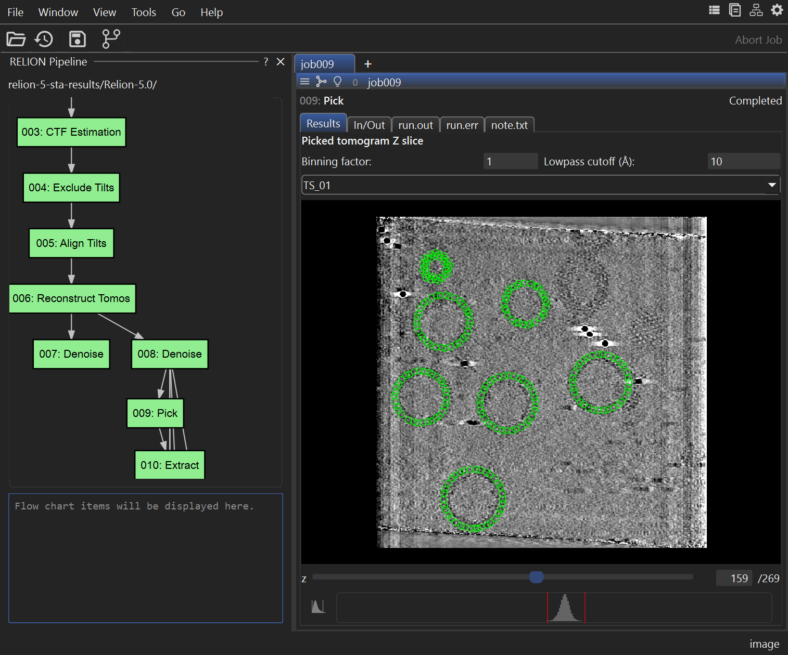

# himena-relion

[](https://pypi.org/project/himena-relion)
[](https://pypi.org/project/himena-relion)

-----



(Original dataset is from [Burt et al.](https://zenodo.org/records/11068319))

`himena-relion` is a modern RELION GUI implemented as a
[himena](https://github.com/hanjinliu/himena) plugin.

:warning: `himena-relion` is actively under development. Please be cautious when using
it for your real data processing.

#### Roadmap

- [x] View (most of the) RELION jobs.
- [x] Efficient 2D/3D rendering using [vispy](https://github.com/vispy/vispy) and EGL over SSH.
- [x] View job flowchart, and open jobs from the flowchart.
- [x] Drag-and-drop support for job inputs and outputs.
- [ ] Run RELION jobs from the GUI.
- [ ] Make implementing "external" jobs type-safer and more python-friendly.

## Installation

`himena-relion` is a plugin of [himena](https://github.com/hanjinliu/himena) plugin. You
will need to install both packages into the same Python environment, and mark
`himena-relion` as a startup plugin of your himena profile. For the detail, please refer
to the [himena documentation](https://himena.readthedocs.io/en/latest/).

```console
pip install himena[recommended] himena-relion  # install packages
himena --new em  # create a new profile named "em"
himena em --install himena-relion  # install the plugin into "em" profile
himena em  # launch the GUI with "em" profile
```

## License

`himena-relion` is distributed under the terms of the [BSD 3-Clause](https://spdx.org/licenses/BSD-3-Clause.html) license.
