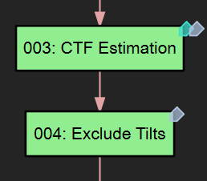

# Useful Features

## Tagging Jobs

{ width=200px loading=lazy }

From right-click > Tag, you can add tags to each job. Tagging is useful for categorizing jobs, especially when you have different branches of jobs focusing on different
structures. You can also use tags to quickly find jobs in the search palette. For
example, you can type "#ribosome" to filter the results to only show the jobs tagged with "ribosome".

## One-Line Status Tip

Some jobs display a one-line status tip at the bottom of the window, when clicked in
the flowchart. The first line of the "note.txt" file in each job directory will also be
displayed so you can use it for a short description of the job.
