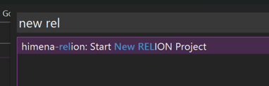
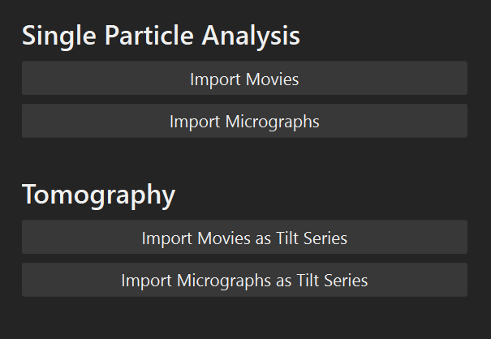
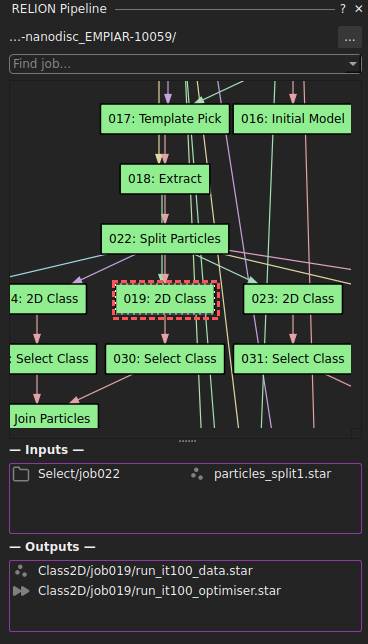
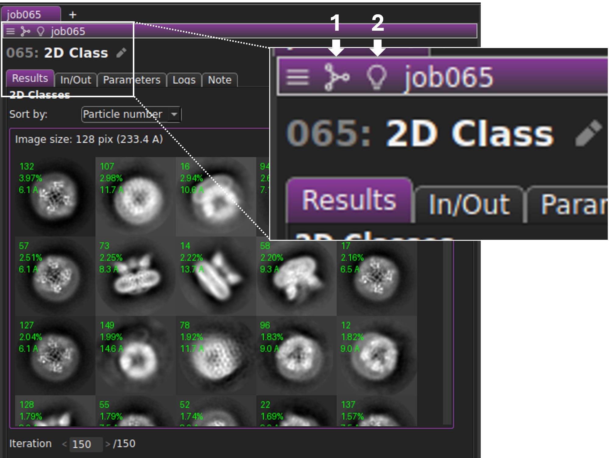
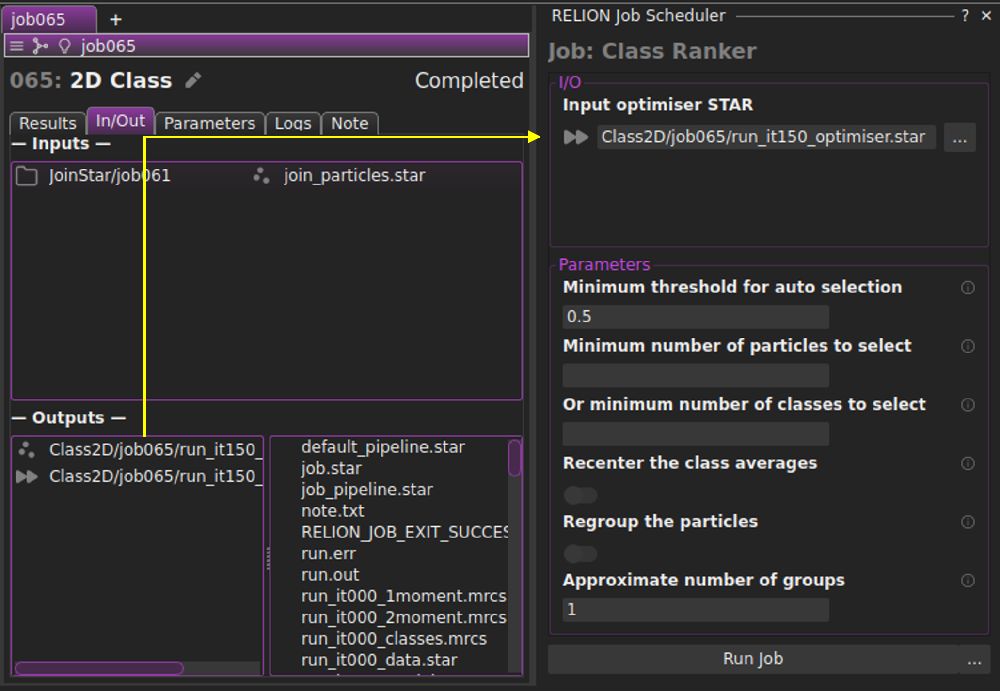

# Getting Started

Run

```bash
himena relion
```

to launch the application.

## Configuration

Before starting your image processing, you need to configure the paths to executables
and scripts that RELION jobs will call.

Open the himena setting dialog (++ctrl+comma++) and select the "Configurations" tab.
Type "relion" in the search bar, and you will see the configuration items related to
RELION as shown below.

{ width=600px loading=lazy }

These values will be automatically used for the RELION jobs that take these executables
or scripts as input.

!!! note

    You can further customize the application, including dark background, keybinding,
    font etc. Please refer to the [himena documentation](https://hanjinliu.github.io/himena/usage/customization/).

## Launch Existing RELION Project

`himena-relion` and RELION GUI is compatible. If you have an existing RELION project,
just run `himena relion` under the project directory

```bash
cd path/to/my-project
himena relion &
```

or pass the project path as an argument

```bash
himena relion path/to/my-project &
```

You can also open a RELION project by:

- ++ctrl+o++ and select the default_pipeline.star file.
- from the "Recent Files" in the startup window.
- from the recent-file command palette (++ctrl+k++ &rarr; ++ctrl+r++)

## Create New RELION Project

If RELION project is not initialized in the current directory yet, you'll have to create
one. You can do this by opening the command palette (++ctrl+shift+p++) and running the "Start New RELION Project" command.

{ width=400px loading=lazy }

Once the default_pipeline.star file is created, you'll see a dock widget on the left.
You can click any of the import jobs to start processing your data.

{ width=400px loading=lazy }

## Job Flowchart

If your RELION project has jobs, the job flowchart will automatically created.

{ width=300px loading=lazy }

In this flowchart, you can double-click nodes to open the job window.

## Job Window

A job window displays the content of the job directory. For most of the cases, the first
tab will show the most informative representation of the job outputs, such as the
processed micrographs, reconstructed particles, or 2D class images.

Each job window runs an independent file watcher so that the content will be
automatically updated (in reasonable time intervals).

{ width=400px loading=lazy }

The top-left corner has useful actions.

The tool button 1 contains actions that are related to RELION job windows (no matter
what job it is), such as "Overwrite" and "Mark As Finished".

The tool button 2 contains hints for the next actions. For example, in a 2D
classification job window, you will see "Select Class". These action hints are very
convenient way to run the next job, as the input parameters will be automatically
filled.

## Scheduling Next Jobs

To run the next job, you can:
- Click the action hint in the job window
- Open the command palette (++ctrl+shift+p++) and type the name of the job you want to
  run.
- In the menubar, go to "Tools > RELION" and find the job you want to run.

{ width=400px loading=lazy }

- By clicking the "Run" button, a job.star file will be created and passed to
  `relion_pipeliner`, which will organize the job pipeline and run the job.

- You can drag-and-drop the items in the input/output panels to fill some of the job
  parameters (yellow line).

!!! note

    Some of the RELION built-in jobs are split into different job types in
    `himena-relion`. For example, the "Motion correction" job in RELION is split into "Motion Correction (MotionCor2)" and "Motion Correction (RELION)". They are the same
    job type when viewed in RELION GUI, but *look* different in `himena-relion`. This is
    because many RELION built-in jobs have incompatible input parameters that could be
    confusing for beginners (e.g. "Write output in float16" is incompatible with "Use RELION's own implementation"). In `himena-relion`, parameter fields are
    re-categorized so that running jobs is more straightforward.

!!! tip "Job scheduling"

    `himena-relion` automatically schedules the job instead of running it immediately,
    when any of the input files are not ready or any of the parent job is not finished.
    This feature is currently integrated with the file watcher for default_pipeline.star
    so that the scheduled jobs will not automatically start if you quit the `himena`
    process.
